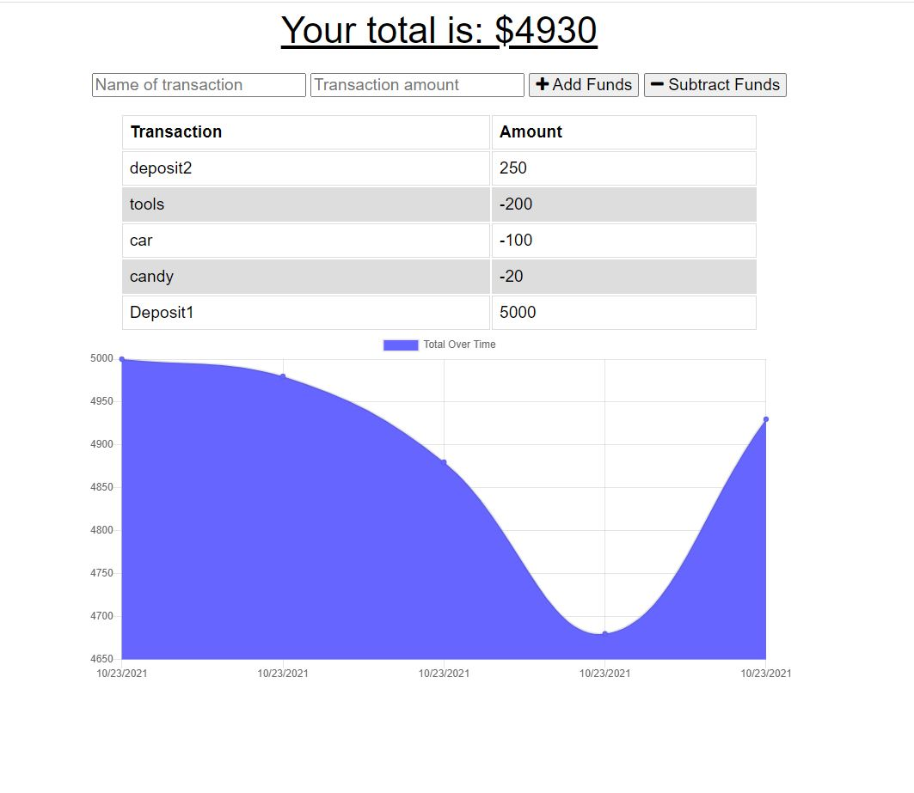

# budget-tracker-pwa


## Description :
```
Budget-tracker is a PWA (Progreesive Web Application) that allows useras to track their spending with online and offline functionality
```

* The requirement from the client was as below:
```
AS AN avid traveler
I WANT to be able to track my withdrawals and deposits with or without a data/internet connection
SO THAT my account balance is accurate when I am traveling 

GIVEN a budget tracker without an internet connection
WHEN the user inputs an expense or deposit
THEN they will receive a notification that they have added an expense or deposit
WHEN the user reestablishes an internet connection
THEN the deposits or expenses added while they were offline are added to their transaction history and their totals are updated
```

## Languages and other components used : 
```
   * npm (node package manager) 
   * Expess.js  
   * MongoDB ( NoSQL Database)
   * Mongoose 
   * indexedDB (NoSQL client-side storage API)
   * service worker ( to add offline functionality)
   * Web manifest
```

## How to install : 
 ```
 To install the application in your computer follow the steps below: 

 1. Clone the repository in your computer :
    - open the command line and go to the directory where you want to clone the repository.
    - then clone the repo by typing : " git clone git@github.com:miraj00/budget-tracker-pwa.git"

 2. Install node.js on your computer by going to https://nodejs.org/en/  

 3. Install MongoDB by going to : https://www.mongodb.com/try/download/community , then configure MongoDB in your computer

  
 4. Run " npm install " in command line to install associated packages.
```

### How to Use the application : 

```
First run " npm start " command in command prompt to start the server and then go to the browser and browse http://localhost:3001/ to test the application in local computer
```

## Below is the screenshot and Deployed application of the Project as per client request ## 



### Deployed Sites ##

[Please click here to see deployed application on Github](https://github.com/miraj00/budget-tracker-pwa)

[Please click here to see deployed application on heroku](https://ancient-falls-66970.herokuapp.com/)

